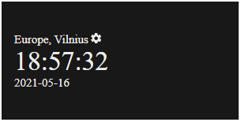
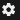
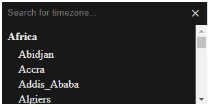
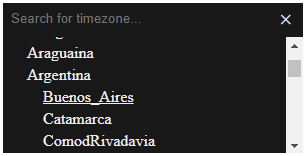
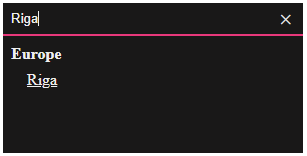
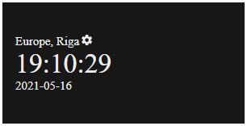

# What is World Clock?

If you need a `simple`, `easy to use`, `responsive` world clock widget for your project, then you came to the right place. World Clock is a **Frontend** (*UI*) widget, which is written using modern WEB technologies - *HTML5*, *CSS*, *JS*. It is as simple as it gets - you see time and date in the selected timezone. Widget was written in a *Plug-n-Play* fashion, you only need to import module code to your JS code and you are ready to go (almost), check out [Installation](#Installation) and [Examples](#Examples) for a reference. 

Component can be used in all major browsers where ES5 standard is compliant. Source code is written in ES6, but is compiled with [Babel](https://babeljs.io/) to ES5.

# Table of contents
- [Description](#Description)
    - [Purpose](#Purpose)
    - [Functions](#Functions)
    - [Restrictions](#Restrictions)
    - [Dependancies](#Dependancies)
- [Documentation](#Documentation)
    - [Configurable attributes](#Configurable-attributes)
        - [Required attributes](#Required-attributes)
        - [Optional attributes](#Optional-attributes)
    - [Classes, fields and methods](#Classes,-fields-and-methods)
        - [Classes](#Classes)
        - [Fields](#Fields)
        - [Methods](#Methods)
    - [Installation](#Installation)
- [Examples](#Examples)
    - [Usage guide](#Usage-guide)
- [Change log](#Change-log)
- [License](#License)
- [Appendix](#Appendix)
    - [List of available timezones](#List-of-available-timezones)

# Description

## Purpose
- If you are too busy with other problems and don't want to waste time re-inventing the wheel
- If your boss asks you to create a frontend world clock widget within a few days
- If the requirements meet [functions](#Functions), which are implemented in this widget

Then grab a copy of this code, [install](#Installation) it to your project, check [examples](#Examples) and Rock-n-Roll!.

## Functions
The widget provides these functions:

- Date and time display
- Timezone selection and search
- Timezone memorization
- Customization:
    - Color theme (dark, light)
    - Toggle show date
    - Toggle show seconds

## Restrictions
The widget can only be used in the frontend, it was designed to meet HTML5 standard, so it's a pure UI widget.


## Dependancies


World Clock widget is dependant on the [Moment.js](https://momentjs.com/) library and [Moment Timezone](https://momentjs.com/timezone/) plugin. These dependancies are required in order to have a manageable API when selecting different timezone, because we didn't want to deal with the different timezone offsets and daylight savings (we also don't want to re-inventing the wheel).

**Important**: If your project doesn't have these libraries included in the scope, widget `automatically` imports these at initialization.

At release time:
- **Moment.js** was on version 2.29.1
- **Moment Timezone** was on version 0.5.33

Dependancies are imported through `CDN` services.

# Documentation

## Configurable attributes

### Required attributes

<br>

`container` - field is *required*. It's an HTML component **id** attribute.

<br>

### Optional attributes

<br>

`theme` - field is *optional*. Controls widget color theme. 

Default value = **WorldClock.Theme.Light**.

Available values = [**WorldClock.Theme.Light**, **WorldClock.Theme.Dark**].

---
     
`showSeconds` - field is *optional*. Show seconds in the clock? 

Default value = **true**.

---

`showDate` - field is *optional*. Show date in the widget? 

Default value = **true**.

<br>

## Classes, fields and methods

<br>

Public API allows to only access `WorldClock` instance, its public fields and methods, which will be documented below.

<br>

### Classes

<br>

`WorldClock` - World Clock public API component, which allows to initialize widget with the defined [attributes](#Configurable-attributes).

<br>

### Fields

<br>

Class `WorldClock`:

|Field|Description|Returns|
|---|---|---|
|container|It's an HTML element, which was referenced by `container` field in the initialization parameters. **You should not change this value directly**.|`any` HTML element|
|wrapper|It's an HTML component to which widget puts its HTML contents. **You should not change this value directly**.|`HTMLDivElement`|
|theme|Widget color theme. Default value = `WorldClock.Theme.Light`. Available values are `WorldClock.Theme.Light` and `WorldClock.Theme.Dark`. **You should not change this value directly**. Use `setTheme(themeValue)` method for that.|`WorldClock.Theme.Light` (`String`) or `WorldClock.Theme.Dark` (`String`)|
|showDate|Should date field be shown in the widget? Default value = `true`. **You should not change this value directly**. Use `setDateShow(value)` method for that.|`Boolean`|
|showSeconds|Should seconds be shown in the clock? Default value = `true`. **You should not change this value directly**. Use `setTimeSecondsShow(value)` method for that.|`Boolean`|
|Theme|User Convenience theme selection property. Available values are `Light` and `Dark`. **You should not change this value**. |`Object`|

<br>

### Methods

<br>

Class `WorldClock`:

|Method|Description|Attributes|Returns|
|---|---|---|---|
|timezoneGroups()|Get all currently available timezone parts. Returns a product of *this.getAllAvailableTimezones()*, because that is saved to the Clock at the initialization time.||All currently available timezone parts.|
|findTimezonePart(type, name)|Find TimezoneObject within the available timezones given by *type* and *name*.| <ul><li>*type* - one of the types from [`"group"`, `"region"`, `"city"`]. </li><li> *name* - name of the part that is being searched. For example - "Vilnius".</li></ul> |`null` - if part was not found. `TimezoneObject` - otherwise.|
|findGroup(name)|Search for a TimezoneGroup in all available timezones.|<ul><li>*name* - `TimezoneGroup` name, which is being searched. </li></ul>|`null` - if group was not found, `TimezoneGroup` - otherwise.|
|findRegion(name)|Search for a TimezoneRegion in all available timezones.|<ul><li>*name* - `TimezoneRegion` name, which is being searched.</li></ul>|`null` - if region was not found, `TimezoneRegion` - otherwise.|
|findCity(name)|Search for a TimezoneCity in all available timezones.|<ul><li>*name* - `TimezoneCity` name, which is being searched. </li></ul>|`null` - if city was not found, `TimezoneCity` - otherwise.|
|selectCurrentTimezone(part)|In order to set current timezone one of the timezone parts must be passed. We automatically detect type of timezone part, then detect if input is recognized. If input is recognized current selected timezone is updated. Otherwise we throw `WorldClockError`.|<ul><li>*part* - `TimezoneObject` part, which should be selected.</li></ul>|*void*|
|getTimezoneGroups()|Get all available timezone groups from moment-timezone. In moment-timezone group, region, city is marked in this format: "Group/Region/City". Method splits all strings by "/" and then collects all parts at index 0. So we get a list of timezone group names.||Array of timezone group names.|
|getAllAvailableTimezones()|Show all available timezones, which are hierarchically related. At the top of hierarchy lies TimezoneGroup Objects. Returns this data structure: <pre><code>{ 'timezone_group_name': TimezoneGroup(), ... } </code></pre> `TimezoneRegion` Objects are included into `TimezoneGroup`. `TimezoneCity` Objects are included into `TimezoneRegion`.||Hierarchical `Object`.|
|setTheme(themeValue)|Validate and set widget theme. If given value is not valid, light theme will be selected.|<ul><li>*themeValue* - controls which widget theme should be selected. Available values: `WorldClock.Theme.Light` and `WorldClock.Theme.Dark`</li></ul>|*void*|
|setDateShow(value)|Validate and set flag, which controls if widget should show date field. Default value = `true`. |*value* - controls if widget should show date field.|*void*|
|setTimeSecondsShow(value)|Validate and set flag, which controls if widget should show seconds. Default = `true`.|*value* - controls if widget should show seconds.|*void*|

All documentation in regards to classes, methods and fields is available in `JSDoc` generated documents, which are listed [here](./docs/api/index.html).

Additional documentation available [here](./docs/DOCS.md#additional-documentation).

<br>

## Installation

<br>

In order to use component you need to:

1. Copy `/build/world_clock.js` file and paste it into your application source, for example `/static/components/world_clock` directory.
2. Check [Dependancies](#Dependancies) and make sure they are met;
3. Import `WorldClock` from the source to your JS;

To start using World Clock widget you only need to import the JS of the component into your code base. Go to the footer of you HTML layout and add this line:

```HTML
<script src="components/world_clock/world_clock.js"></script>
```

Note: `src` - should be equal to the path in your server public directory, where component source is accessible. 
After this step `WorldClock` will be accessible in your code base, because library was exposed to the `window` object.


4. Initialize `WorldClock` object with required attributes (see [Examples](#Examples));


# Examples

1. We want to initialize widget in the **default** configuration:
```JS
    const clock = new WorldClock({
        container: "worldClockContainer"
    });
```

2. We want to initialize widget with the **dark theme**:
```JS
    const clock = new WorldClock({
        container: "worldClockContainer",
        theme: WorldClock.Theme.Dark
    });
```

3. We want to initialize widget with **dark theme** and **hidden date** field:
```JS
    const clock = new WorldClock({
        container: "worldClockContainer",
        theme: WorldClock.Theme.Dark,
        showDate: false
    });
```

4. We want to initialize widget with **light theme** and **hidden seconds** field:
```JS
    const clock = new WorldClock({
        container: "worldClockContainer",
        theme: WorldClock.Theme.Light,
        showSeconds: false
    });
```

More examples:

See live example (Express.Js application) in directory `/demo`, where you will be able to configure widget live.


## Usage guide

1. We make sure to follow steps defined at [installation](#Installation).
2. We make sure that we correctly initialize world clock in our code following defined [examples](#Examples).
3. We give some width/height for the container, which will hold our world clock.
```HTML
<style>
.clock {
    width: 300px;
    height: 150px;
}
</style>
<div id="worldClock" class="clock"></div>
```
4. We see widget view in the UI after we load the page.



5. We want to change the timezone:
    1. First we need click on the  icon.
    2. Now we will be able to see the view like this:

    

    3. We can scroll the list and click on one of the list elements:

        

    4. Or we can search for a timezone if we know what we want to select and then click on it:
    
    

    5. Once we click on the timezone we want, widget will update its state and we will be returned to the main view of the widget:

    

6. After page reload, timezone will be selected from memory.


# Change Log
- v1.0
    - Initial project release.


# License
World Clock is released under the Apache 2.0 license.


# Appendix
## List of available timezones

The list of available timezones is based on the *moment.js* timezone plugin. We retrieve all available zones and group them into three categories: `TimezoneGroup`, `TimezoneRegion`, `TimezoneCity`.

Link from documentation [here](https://momentjs.com/timezone/docs/#/using-timezones/getting-zone-names/).

Example of a list of timezones:

```
- Africa
    - Abidjan
    - Accra
    - Addis_Ababa
    ...
- America
    - Adak
    - Argentina
        - Buenos_Aires
        - Catamarca
        ...
 ...
```
Full list is available [here](./docs/TIMEZONES.md#Full-timezones-list).
