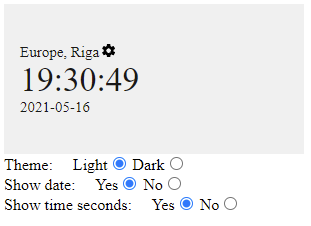

# Setup

1. In order to use this example you need to have `npm` and `Node.Js` installed in  your `PATH`. 

2. Follow creator guides how to install and setup [here](https://nodejs.org/en/download/).

3. After setting up dependancies, reload your terminal.

4. Open your terminal and navigate to `this` directory *demo*.

5. Write command:

```
npm install
```

6. When installation process is finished, run command:

```
npm start
```

7. Demo server will be launched and application will be accessible [here](http://localhost:3000). 

```
http://localhost:3000
```

8. Feel free to experiment with different configurations available:

