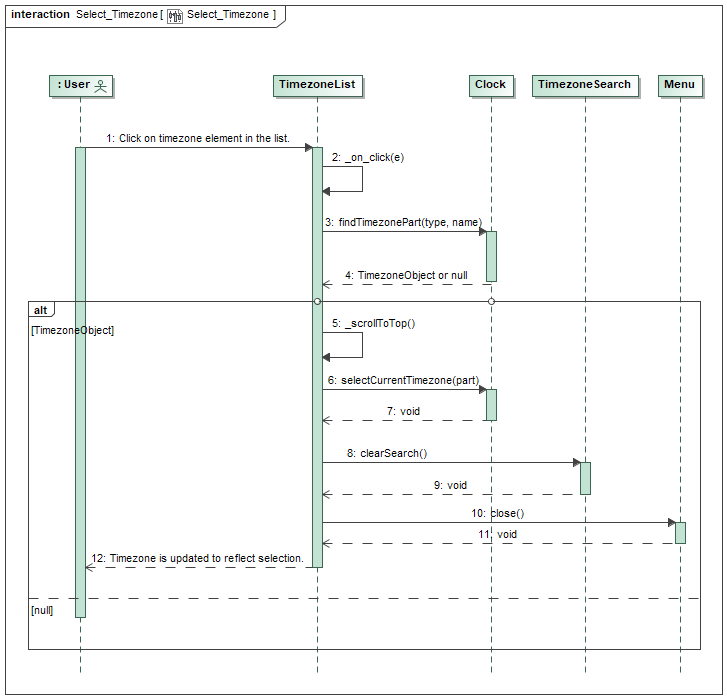

# Additional documentation

## Table of contents
- [Class diagram](##Class-diagram)
- [Deployment diagram](##Deployment-diagram)
- [Sequence diagrams](##Sequence-diagrams)
    - [Open settings](###Open-settings)
    - [Search for timezone](###Search-for-timezone)
    - [Select timezone](###Select-timezone)

## Class diagram

Class diagram of `WorldClock` widget source code. Descriptions are available in [here](./api/index.html).

`Utils`, `Datatype`, `WorldClockError` and `Config` classes are used in almost every class, because they are sigleton classes, they do not need any dependancies, so its easy to import and use any required fields. However, in this class diagram, dependancy lines are only connected from `Clock` in order to show, that hey are used at least somewhere.

## Deployment diagram

Deployment diagram of `WorldClock` widget source code. `WorldClock` library sits independently of your `Frontend` package. It's importend into HTML code with `script` tag.

## Sequence diagrams

Typical use cases like: *Open settings*, *Search for timezone*, *Select timezone* are covered with sequence diagrams. See attached images below.

### Open settings

### Search for timezone

### Select timezone

